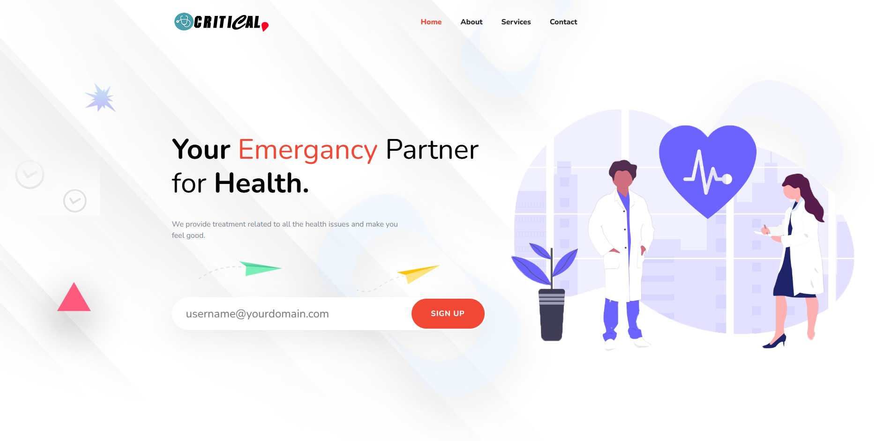
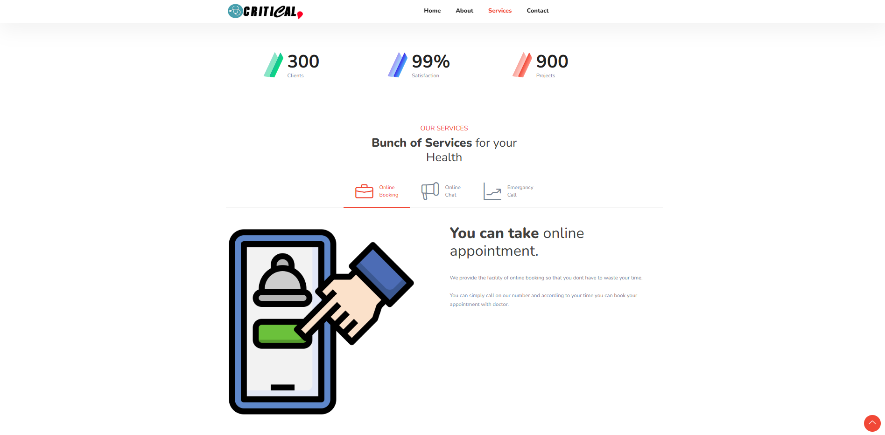

# HealthCare Landing Page



# HealthCare Appointment Page




### [✨ Visit Website](https://healthcare-website.app/)

# HealthCare Website

HealthCare is a modern, responsive website designed to showcase healthcare services, provide online appointments, and enhance customer interaction through online chat and emergency contact features.

## Features

- **Responsive Design**: Adapts to all screen sizes for a seamless user experience.
- **Preloader Animation**: Interactive loading animation for better user engagement.
- **Dynamic Navigation**: Smooth scrolling between sections.
- **Services Section**: Highlighted healthcare services like online booking, chat, and emergency calls.
- **Testimonials**: Showcase client feedback to build trust.
- **Contact Form**: Allows users to leave messages and get in touch.
- **Footer Section**: Quick access to contact info, social links, and additional resources.

## Technologies Used

- **HTML5**: Markup structure
- **CSS3**: Styling
  - Bootstrap for responsiveness
  - Animation libraries for effects
- **JavaScript**: Interactivity
  - jQuery and plugins for dynamic content
- **External Libraries**:
  - [Slick Slider](https://kenwheeler.github.io/slick/)
  - [Magnific Popup](https://dimsemenov.com/plugins/magnific-popup/)
  - WOW.js for animations

## File Structure
├── assets/ │ ├── css/ │ ├── images/ │ ├── js/ │ └── contact.php ├── index.html └── README.md


## Setup Instructions

1. **Clone the Repository**:
   ```bash
   git clone https://github.com/muhammadzubairbaig/healthcare-website.git
   cd healthcare-website


## Dependencies

1. Font Awesome for icons
2. Line Icons for lightweight vector icons
3. jQuery for DOM manipulation
4. Bootstrap for responsive grid and components

## Contributing
Feel free to fork this project, create a new branch, and submit a pull request for contributions.


"# healthcare-website" 
